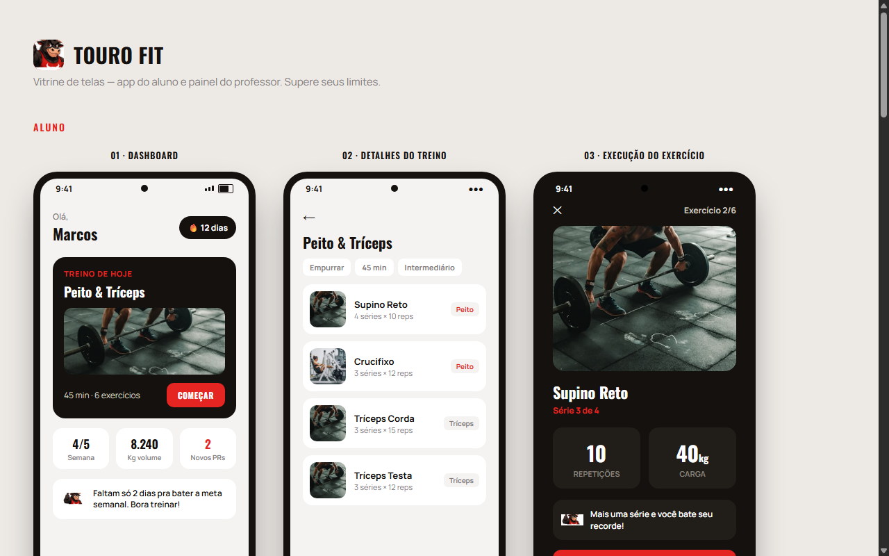

# Boi Training — Touro Fit

Aplicativo de treino para **profissionais** (professores/personal trainers) e **alunos**.

Este repositório contém o protótipo visual (vitrine de telas) do app **Touro Fit**: o fluxo do aluno e o painel do professor, antes da implementação completa.

## Preview



> A imagem acima aparece direto no GitHub. Você **não precisa clonar** o repositório para ver o protótipo.

### Ver o protótipo interativo

Abra a [vitrine ao vivo](https://fabiogarcia02.github.io/Boi_Training/) (GitHub Pages) para navegar nas telas no navegador.

Se a página ainda não estiver no ar, ative em **Settings → Pages → Branch: `main` → Folder: `/docs`**.

Também é possível abrir localmente o arquivo `docs/index.html` no navegador.

## O que é o projeto

O **Boi Training / Touro Fit** é um app de gestão e execução de treinos com dois lados:

| Perfil | Função |
| --- | --- |
| **Aluno** | Dashboard, treino do dia, detalhes dos exercícios, execução com séries, cargas e progresso |
| **Professor** | Painel para acompanhar e organizar treinos dos alunos |

Foco da experiência: clareza na rotina de treino, motivação (metas, streak, PRs) e acompanhamento profissional.

## Status

- [x] Protótipo visual (vitrine HTML)
- [ ] App em desenvolvimento

## Estrutura

```
├── README.md
├── preview/
│   └── vitrine.png      # imagem exibida neste README
└── docs/
    └── index.html       # protótipo interativo (GitHub Pages)
```

## Licença

Uso privado / sob definição do autor do repositório.
